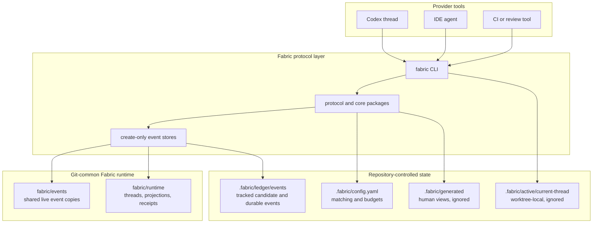
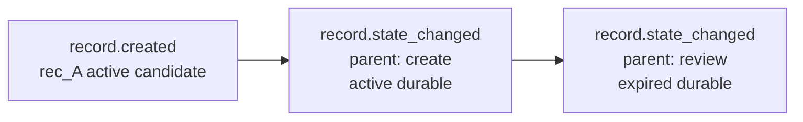
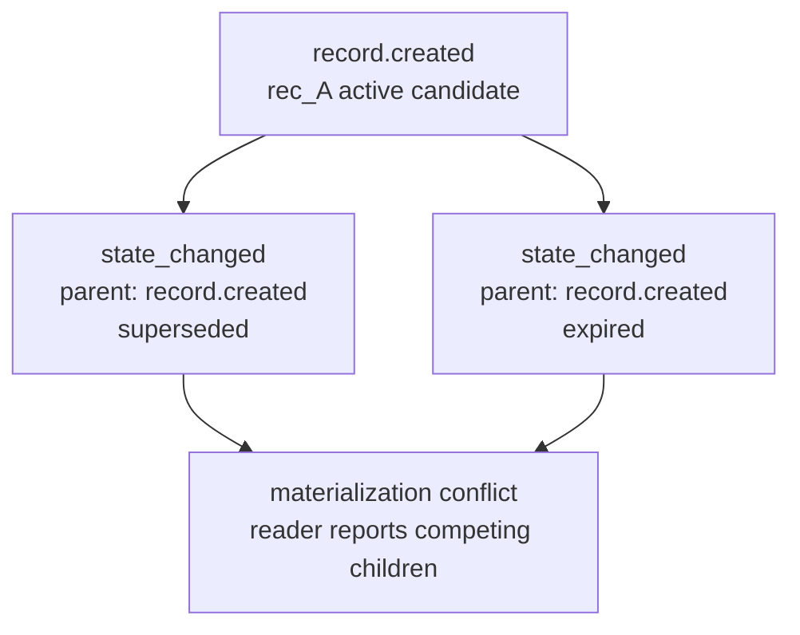
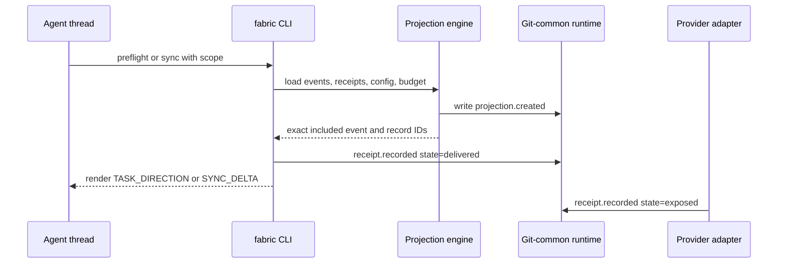
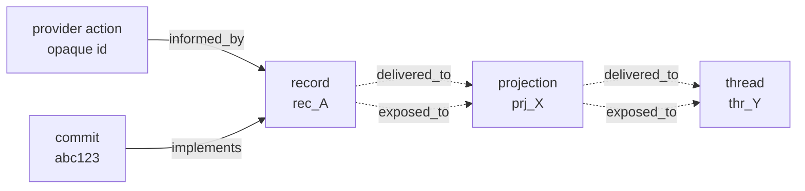
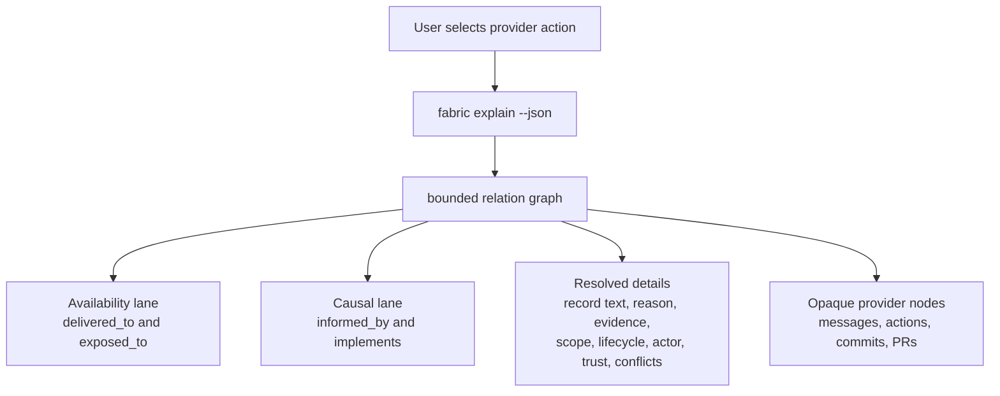

# Fabric Local V1 Explainer

Fabric Local V1 is a Git-backed protocol for repository direction and causal
provenance across agent threads, worktrees, and provider tools. The protocol
state is a small set of immutable events; the CLI is only the local reference
client.

Authoritative references:

- [Protocol specification](../PROTOCOL.md)
- [README](../README.md)
- [Conformance claim](../CONFORMANCE.md)

## Architecture

Fabric separates protocol state from generated views and provider-specific
conversation data. Records, lifecycle transitions, threads, projections,
receipts, and relations are stored as versioned protocol events. Provider
objects such as messages, actions, commits, issues, PRs, and evidence are linked
through opaque `NodeRef` identifiers rather than copied into Fabric.

Tracked state is for reusable project direction: `.fabric/config.yaml`, managed
skills, and candidate or durable ledger events. Local and shared runtime state is
not project direction. Live records, thread registries, projections, receipts,
generated Markdown, and the current-thread pointer coordinate active work but
must not be treated as the authoritative ledger.

## Record Creation And Lifecycle

Every mutation is an immutable `EventEnvelope` with a typed UUIDv7 identifier.
Writers use create-only semantics: byte-equivalent duplicate event IDs are
idempotent, but divergent content for the same event ID is a conflict.

A record is created once with `record.created`. Later status or durability
changes append `record.state_changed` events. Each lifecycle event names the
exact parent event it extends, so readers materialize a record by walking an
explicit parent chain.

Competing children are explicit conflicts. If two lifecycle changes extend the
same parent, a conforming reader reports the competing revisions and stops
materializing that branch. It must not pick a winner by timestamp, file order,
ID order, or last writer.

Durability is separate from lifecycle. `live` records coordinate active
worktrees through the Git-common runtime. `candidate` records are tracked and
await curation. `durable` records are reviewed long-term repository direction.
Durable promotion requires human- or reviewer-confirmed rationale, and
lower-trust records cannot silently supersede higher-trust records.

## Projection And Exposure

Projection is deterministic and local. Given the same events, scope, config,
receipts, and budget, conforming clients select the same records without an LLM,
embedding call, network service, or provider transcript.

A projection records exact event revision IDs, materialized record IDs, match
reasons, budget omissions, and lifecycle conflicts. Delivery receipts mean the
reference client rendered the projection. Exposure receipts mean a provider
adapter confirms the projection actually entered model context. Omitted records
remain pending and are eligible for the next synchronization.

## Provenance

Fabric deliberately separates availability from causal influence. Availability
answers, "Was this direction available to the thread?" Causality answers, "Did
the agent or adapter explicitly declare this direction as influencing or being
implemented by the action?"

`delivered_to` and `exposed_to` edges are availability relations. They must not
be rendered as proof that the model used a record. Only explicit `informed_by`
and `implements` relations declare causal influence. Fabric does not infer
motivation from text similarity or from the fact that context was present.

Relations can also connect records to evidence and to each other:
`derived_from`, `supersedes`, `challenges`, and `resolves` preserve review
history and disagreement without storing source code, patches, prompts, or full
transcripts.

## Provider "Why Did This Happen?" View

A provider can render a motivation view without parsing generated Markdown:

1. Create or resume a Fabric thread with explicit scope.
2. Consume `preflight` or `sync` projections before acting.
3. Acknowledge adapter-confirmed exposure when the projection enters model
   context.
4. After important messages, tool actions, commits, or PRs, write explicit
   `informed_by` and `implements` relations for the records actually used.
5. Call `fabric explain --node ... --direction both --depth ... --json` when a
   user asks why a provider object happened.

The view should make three states clear:

- Available: the record was delivered or exposed through an exact projection and
  receipt path.
- Causal: the adapter or actor asserted `informed_by` or `implements` for the
  selected object.
- Unknown: the record may be related in repository history, but Fabric has no
  explicit exposure receipt or causal relation for this object.

Missing provider content is normal. Fabric can retain opaque node IDs and
optional deep links even if the external message, action, or review is deleted
or inaccessible.
