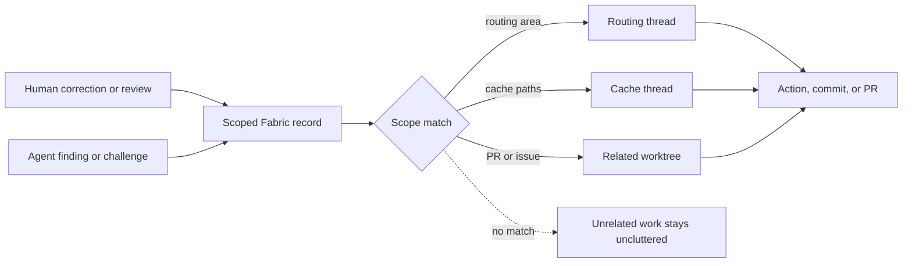
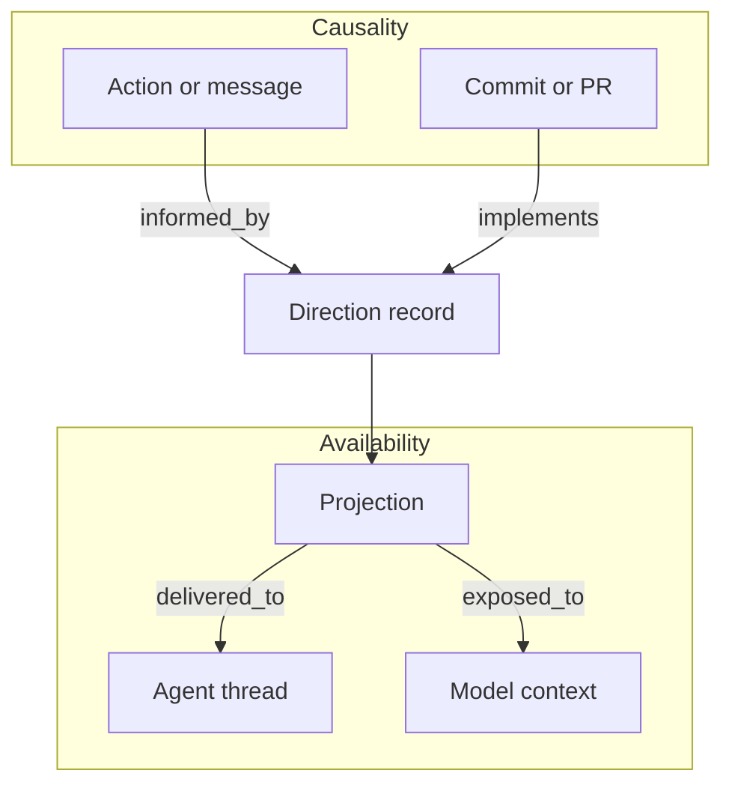

# Why Fabric Exists

The repository had already answered the question. The person doing the work did
not know that, and neither did the agent.

That sentence describes an uncomfortable amount of modern software development.
We keep treating it as a prompting problem, a model problem, or a documentation
problem. Often it is something more ordinary and more embarrassing: the
organization learned, but the work did not inherit the learning.

This article grew out of a conversation between two engineers at a large
technology company. The scene below is a composite; names, project details, and
internal context have been removed or changed. The failure itself is real.

## A Conversation About Forgetting

One engineer asked whether the trouble around AI-assisted development was
really coordination debt.

The answer was immediate: coordination and alignment were part of it, but the
company did not lack either. Teams held discussions. Leads set direction.
Reviewers explained tradeoffs. The problem was that the next person often did
not follow what had been decided. Everyone arrived ready to own the problem and
build a version in their own image.

Then came a painfully mundane example. A team had built a complete listing
endpoint. Someone later asked whether the results could be filtered. Instead of
extending the endpoint whose job was already to list those resources, another
implementation proposed a second listing endpoint with filters.

Nothing about this was technically difficult. The project had a focus. The
ownership boundary already existed. The team had already paid for the design
conversation. Yet the next unit of work behaved as if none of that had happened.

The conversation moved to pull requests. One engineer said he could open some
PRs and understand what changed, but not why anyone was doing it. Sometimes a
constraint had been explained in another PR and a later change still pushed the
rejected idea through a side door. There was no visible learning between
attempts.

That used to happen less often. People absorbed a project's style through
review. They saw the same maintainers reject the same class of mistake, learned
the local boundaries, and gradually stopped proposing it. The learning was
imperfect and social, but it accumulated.

Now more execution happens inside agents. Each thread is a disposable artifact.
Unless somebody explicitly tells the next thread that approach X was rejected
in discussion Y, it does not know. Add parallel worktrees and several agents,
and the same bad proposal can appear three times before the first correction has
left its original conversation.

The irony was hard to miss: people were starting to work like stateless agent
threads, while agent threads inherited the oldest organizational failure of all.
Neither side had reliable memory of why the project had chosen its direction.

## We Keep Paying for the Same Decision

This is the part worth ranting about. We already spend the expensive human time.
We debate the boundary. We inspect the failure. We reject the tempting shortcut.
We write the review. Then we throw away the part that would make the next piece
of work cheaper.

The patch survives. The reason becomes folklore.

The transcript survives somewhere in a provider account. Nobody will replay it.

The PR remains searchable. Nobody starting a seemingly unrelated task knows
which old PR contains the warning they need.

The architecture document says what the system looks like, but not necessarily
which plausible alternative was tried, rejected, and should not be smuggled
back in six months later.

We can put more rules in `AGENTS.md`, but a large project eventually turns that
file into an encyclopedia. Every agent receives every warning, most warnings do
not apply, the useful ones disappear into prompt sediment, and maintainers stop
knowing which instructions are still alive. A global rule file is not scoped
memory. It is a noticeboard.

So the problem is not simply that decisions are missing. Decisions exist. The
problem is that they are trapped in the context where they were made, stripped
of scope when copied, or disconnected from the later action they were supposed
to influence.

Fabric began as a response to that failure. It is a provider-neutral protocol
for persistent repository decisions and causal provenance across agent threads,
worktrees, and tools. It is not a transcript archive, another issue tracker, or
a replacement for Git. It is an attempt to preserve the small amount of prior
reasoning that should change what the next person or agent does.

The protocol boundary is defined in [PROTOCOL.md](../PROTOCOL.md). The local
reference client and repository behavior are summarized in
[README.md](../README.md), the current Local V1 evidence is stated in
[CONFORMANCE.md](../CONFORMANCE.md), and the optional future private relay is
kept separate in [SERVICE.md](../SERVICE.md).

## What a Small OSS Sample Revealed

This is not only a large-company story. To test the same failure against public
project activity, we inspected a bounded sample of 100 pull requests merged into
`vercel/next.js` from June 15 through June 24, 2026. This was an exploratory
sample, not a representative benchmark, but it showed why raw PR replay is a
poor context strategy.

Across those 100 PRs, GitHub returned 234 top-level issue comments. Two hundred
were automation comments and 34 were human comments. The same PRs contained 311
submitted reviews, but only 29 review bodies contained text; 116 were approvals.
Useful rationale was often elsewhere: in the PR description, commit history, or
inline review threads.

The counts came from GitHub's PR metadata for the 100 most recent merged PRs at
collection time. Top-level comments from `github-actions`,
`vercel-release-bot`, and accounts whose login ended in `[bot]` were classified
as automated. That heuristic is intentionally simple and the figures should be
read as a snapshot.

We then examined three PRs in detail:

| PR | Inline comments | Direction worth preserving |
|---|---:|---|
| [`#95065`](https://github.com/vercel/next.js/pull/95065) | 7 | Sort Turbopack modules by path before ID to preserve gzip locality; use a tuple fallback when ordering `AssetIdent` is difficult. |
| [`#95066`](https://github.com/vercel/next.js/pull/95066) | 2 | Match every prerendered route, including zero-fallback routes, before choosing the most-specific fallback parameters. |
| [`#95069`](https://github.com/vercel/next.js/pull/95069) | 1 | Put hard agent-skill bail-outs before upgrade guidance and account for all common `app` and `pages` directory layouts. |

Fabric dry-runs turned each discussion into one compact candidate record with
scope, rationale, rejected paths, preferred paths, and evidence links. No
records were ingested during the experiment. The exercise exposed an important
boundary: Fabric can reduce future reading only if acquisition filters
automation noise and humans curate what is actually reusable. Bulk ingestion
would preserve the problem in a different format.

## Large Projects Have Local Truths

In a small codebase, a handful of conventions can live in a README or in the
heads of two maintainers. In a large project, direction is rarely universal.
The rendering subsystem may have different compatibility constraints from the
build pipeline. A shared API layer may own pagination semantics that feature
teams must not duplicate. One package may be migrating to a new abstraction
while a neighboring package must remain on the old one until a release closes.

These are not merely facts about files. They are decisions with boundaries:
this applies to a particular area, path, issue, or PR; this alternative was
considered and rejected; this exception is temporary; this reviewer or human
made the call for a specific reason.

Most existing ways of communicating those decisions break down with scale. A
global instruction file becomes crowded with rules that do not apply to most
work. Team documentation drifts away from the implementation. Review comments
reach the people on one PR but not the agent starting related work tomorrow.
Word of mouth depends on knowing whom to ask. The result is a familiar kind of
organizational latency: the repository already learned something, but every new
person or agent has to learn it again.

Fabric makes direction addressable. A record can be scoped to a repository,
issue, PR, configured area, or path. A thread declares the scope of its work,
and deterministic projection selects the relevant active records within a
budget. The goal is not to put the entire organization's memory into every
prompt. It is to give each task the small set of decisions that can actually
change its outcome.

Consider a large framework with separate routing, caching, bundling, and
developer-tooling areas. A routing reviewer decides that development behavior
must choose the most-specific prerendered route that matches the requested URL,
because choosing only by the number of fallback parameters can apply state from
the wrong route. Captured as area- and path-scoped direction, that decision can
reach later routing work without burdening an unrelated documentation or CSS
task. The rationale and rejected approach travel with the instruction, so the
next contributor does not have to reverse-engineer the rule from the final
diff.

Scope is what turns repository memory from a larger prompt into useful context.

## People Decide; Agents Carry Direction Forward

Fabric is not meant to move authority from maintainers to agents. It gives
people a durable way to express authority across the many contexts where work
now happens.

A maintainer may establish a constraint in review. An engineer may explain why
a shared layer owns a behavior. An agent may discover a reproducible finding in
one worktree. Another agent may challenge an older decision because new evidence
changes the tradeoff. Fabric can preserve each contribution with its source,
scope, confidence, trust claim, rationale, and lifecycle, while keeping the
difference between them visible.

That difference matters. Human- or reviewer-confirmed rationale is required for
durable promotion. Lower-trust direction cannot silently replace stronger
direction; it must challenge it or receive explicit approval. A challenge is
not treated as disobedience or quietly resolved by whichever event was written
last. It becomes reviewable repository state.

This creates a practical collaboration loop:

1. A person or agent records a compact decision, correction, finding, or
   challenge in the scope where it applies.
2. Concurrent threads receive relevant live direction before acting, including
   updates from sibling worktrees.
3. Agents align with that direction, or make disagreement explicit rather than
   silently taking a conflicting path.
4. Important actions and commits can declare which records informed or were
   implemented by them.
5. After the work, temporary coordination expires or is discarded, while
   genuinely reusable direction can be reviewed and promoted.

The value is cumulative. Review stops being the only place where architectural
knowledge is transmitted. Senior engineers spend less time repeating the same
correction. New contributors encounter the rationale near the area where it
matters. Agents stop behaving as if every thread is the repository's first day.

The protocol does not require every useful observation to become permanent.
Live records coordinate active worktrees. Candidate records await curation.
Durable records represent reviewed long-term direction. This keeps immediate
coordination fast without turning every comment into organizational law.

## Why Transcripts Are Not Repository Memory

The obvious answer is to keep every prompt and response. Fabric deliberately
does not do that.

Transcripts are verbose, provider-owned, privacy-sensitive, and poorly shaped
for future work. They contain brainstorming, mistakes, credentials-adjacent
context, stale assumptions, and long passages that should not become durable
repository knowledge. Replaying transcripts into future contexts also wastes
budget and still leaves the important question unresolved: which few facts
should change what the next agent does?

Fabric treats a useful repository memory as a compact record: a decision,
finding, requirement, challenge, review direction, or note with scope, rationale,
confidence, trust, lifecycle state, and evidence references. The protocol
explicitly says record text must not contain source code, patches, complete
prompts, or transcripts. External content stays in the system that owns it;
Fabric keeps opaque references and short summaries.

That makes repository memory sparse by design. The point is not to remember
everything an agent saw. The point is to preserve the small set of facts that
can change future work or explain past work.

## Why Git Alone Is Not Enough

Git is excellent at preserving content history. It can show what changed, when
it changed, and who authored the commit. It is not designed to answer every
question an agent-platform user will ask later:

- Which human correction was available before this action?
- Which review finding explicitly influenced this commit?
- Which rejected path should a new thread avoid reopening?
- Was this direction merely delivered to the model, or did the agent declare it
  as causal?
- Did two worktrees create conflicting lifecycle updates, or did one silently
  win because it was newer?

Fabric does not replace Git. In Local V1, it uses Git-controlled storage as the
local trust and audit boundary. Candidate and durable events are tracked as
immutable ledger files; live coordination is shared through the Git-common
runtime used by sibling worktrees. Generated Markdown files are just human views,
not authoritative state.

That division matters. Git keeps the code and reviewed ledger history. Fabric
adds typed events, scoped records, lifecycle transitions, projections, receipts,
and relations so tools can explain why a repository action happened without
scraping transcripts or guessing from diffs.

## The Coordination Failure Across Worktrees

Parallel worktrees make the problem concrete. Each worktree can have its own
agent thread, local files, and partial plan, but the repository still needs one
shared understanding of active direction.

Fabric models that with scoped threads and deterministic projection. Direction
can match by repository, issue, PR, area, path, or global scope. Before acting, a
thread can receive the relevant subset of active records. During work, live
records can coordinate sibling worktrees without first becoming long-term
policy. After work completes, temporary records can expire, be discarded, or be
promoted through explicit lifecycle events.

The protocol avoids last-writer-wins mutation. Events are immutable. Lifecycle
changes append child events to a parent revision. If two lifecycle changes
compete from the same parent, readers must report a conflict instead of choosing
by timestamp, file order, or ID order. That is exactly the sort of behavior a
multi-agent repository needs: disagreement should become visible, not silently
papered over.

## Availability Is Not Causal Influence

Fabric's most important distinction is also one of the easiest to blur.

There are two separate questions:

1. What direction was available to a thread?
2. What direction did an agent, adapter, commit, PR, or action explicitly
   declare as influential or implemented?

The first question is answered by projections and receipts. A projection records
which event revisions were selected for a context view and why. A receipt can
record delivery, or adapter-confirmed exposure, when a provider integration knows
the projection actually entered model context.

That proves availability. It does not prove motivation.

The second question is answered by causal relations such as `informed_by` and
`implements`. Fabric does not infer causality from textual similarity or from
the mere fact that something was in context. If a provider only records that a
decision was exposed to the model, a truthful UI can say the decision was
available. It may say the decision informed an action only when an actor records
that explicit causal edge.

This distinction is what lets Fabric support honest "why did this happen?"
views. A provider can render delivered or exposed availability paths separately
from `informed_by` and `implements` causal paths, alongside unresolved external
nodes, record rationale, evidence, trust claims, and lifecycle state. That view
can show what was available without pretending that context delivery is mind
reading.

The projection paths show availability: the record was selected, delivered, or
confirmed in model context. The causal edges exist only after an actor explicitly
asserts influence or implementation. One does not imply the other.

## A Provider-Neutral Protocol, Not a Provider Feature

Fabric is intentionally provider-neutral. Its external node references use
opaque provider-owned identifiers for messages, actions, commits, issues, PRs,
and evidence. The protocol does not require those systems to expose transcript
content, and clients must not infer content from opaque IDs.

That is important for agent-platform builders. Codex, Claude, IDE agents, CI
tools, review systems, and future integrations should be able to participate in
one repository decision graph without one provider owning the memory layer. A
native adapter can create or resume a Fabric thread, consume a projection,
acknowledge actual model exposure, and then record explicit causal relations for
important messages, actions, commits, or PRs.

The protocol is the product boundary. The CLI in this repository is the local
reference client, not the only possible implementation. The conformance claim
covers the Local V1 event model, storage behavior, materialization, projection,
receipt handling, relation graph, trust validation, explanation output, and
machine-response contract for the checked source revision. Other clients can
target the same artifacts and semantics without parsing the reference client's
human Markdown views.

## Local-First by Design

Fabric works locally without an account, daemon, network service, database, or
LLM call. That is not an implementation accident; it is part of the design.

Local V1 uses immutable event files and a shared Git-common runtime so sibling
worktrees can coordinate immediately. The repository can carry candidate and
durable direction through normal Git review. Agents can run preflight, sync,
record notes, create challenges, and traverse explanations while the protocol
state remains inspectable in repository-controlled storage.

The trust boundary is correspondingly modest and explicit. Local V1 trust claims
are claims, not cryptographic identity proofs. Durable promotion requires
human- or reviewer-confirmed rationale, and lower-trust records must not silently
supersede stronger direction. They can challenge it, or a human can explicitly
approve replacement.

That local-first stance also keeps Fabric useful before any platform integration
exists. A team can dogfood the protocol inside a repository, learn what direction
is worth preserving, and keep the history even if providers, tools, or hosted
services change.

## The Future Relay Is Optional

[SERVICE.md](../SERVICE.md) describes a possible private Fabric service, but it
is intentionally not part of Local V1. There is no server, network client,
authentication system, account model, signing layer, or encryption
implementation in the local conformance claim.

The future service exists for a narrower reason: local Git-common sharing is not
enough when repository memory must synchronize across machines, teams, and
providers. The proposed service is an optional end-to-end encrypted relay for
Fabric protocol events, not a source-code host, search index, transcript store,
LLM gateway, provider proxy, or semantic authority.

The privacy line is strict. The service must not receive source code, patches,
plaintext direction, rationale, evidence, prompts, model responses, transcripts,
repository credentials, or decrypted projections. Matching, projection,
conflict materialization, and explanation remain client-side. The relay may see
only routing metadata such as accounts, devices, opaque repository and event
identifiers, membership metadata, timestamps, blob sizes, and delivery receipts,
and even that leakage must be documented honestly.

Most importantly, service adoption must not convert a repository into a
service-only format. Local Git-backed operation remains complete and
first-class. The relay is a transport option for encrypted blobs, not the source
of protocol meaning.

## What Fabric Makes Possible

Fabric gives repositories a way to remember the small things that compound:

- Human corrections that should affect sibling threads immediately.
- Review rationale that should survive the PR conversation.
- Rejected paths that should not be rediscovered every week.
- Temporary coordination that should expire instead of becoming permanent lore.
- Durable direction that should be traceable to evidence and trust claims.
- Provider actions that can be explained by explicit provenance rather than
  inferred after the fact.

For engineers, that means less repeated explanation and fewer regressions into
known-bad approaches. For agent-platform builders, it means there is a clean
adapter contract for repository memory: expose what was available, record what
was actually causal, preserve opaque links to provider objects, and let the
repository own the decision graph.

Fabric exists because parallel agent work needs memory that is smaller than a
transcript, richer than a commit, more portable than a provider feature, and
more honest than a guessed explanation.
